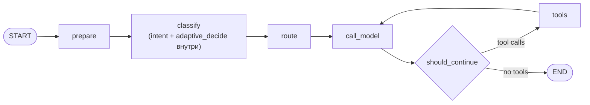

# Anki Lite — архитектура и компоненты

Монорепо (`front/` + `back/` + `llm/`) для изучения английского по интервальным повторениям (SRS),
с AI-функциями поверх встроенного Python-бэкенда через gRPC. Go-монолит владеет словарём/SRS/
аккаунтами, вся «умная» часть (LLM-чат, RAG, structured output) — на стороне Python; Go — тонкий
gRPC-клиент, деградирует до фоллбэков при недоступности AI.

## Система целиком

```
Браузер
  ├─ / (React-лендинг, front/landing/dist)      — маркетинг, кнопка «Начать» → /app
  └─ /app (front/web/index.html + app.js)       — сам продукт (vanilla JS, без сборки)
         │ REST /api/v1/* (JWT в заголовке)
         ▼
   Go-монолит (back/cmd/server) ──gRPC (llm-service:50051)──▶ llm/ (Python, LangGraph-агент)
         │                                                          │
         ▼                                                          ▼
      Postgres (ankis-db)                              Postgres+pgvector (llm-db) + MinIO (файлы)
```

Все три части (`front/`, `back/`, `llm/`) живут в одном git-репозитории (`github.com/Zitniks/anki`,
приватный) и собираются в ОДИН Docker-образ (`Dockerfile` в корне) + отдельный образ `llm/Dockerfile`
— два контейнера, задеплоенных вместе через `deploy/docker-compose.yml` (см. раздел «Деплой»).

## `back/` — Go-монолит

`back/cmd/server/main.go` — единственная точка входа:
1. Читает `DATABASE_URL`, `JWT_SECRET` (обязательные, fatal при отсутствии).
2. Поднимает `pgxpool.Pool` → Postgres, прогоняет `back/migrations/*.sql` через `goose` (в
   докер-образе — на старте контейнера, см. `docker-entrypoint.sh`).
3. Синхронизирует слова из `anki_levels_and_lifecycle_cards.md` (если файл есть, необязательно).
4. Поднимает gRPC-клиент к `llm-service` (`internal/ai`), не блокируясь на недоступности —
   `Ready()` проверяется точечно, UI показывает статус AI отдельно.
5. Раздаёт статику: `/assets` → `front/web`, `/landing-assets` → `front/landing/dist`,
   плюс три JSON-файла с контентом (`theory_tenses.json`, `word_topics.json`,
   `book_norwood_builder.json`, сгенерированы одноразовыми скриптами в `back/scripts/`).
6. `/` — лендинг (`front/landing/dist/index.html`), `/app` — само приложение
   (`front/web/index.html`).

### `back/internal/` — пакеты

| Пакет | Отвечает за |
|---|---|
| `api` | HTTP-хендлеры (Gin) — auth, words, review, placement, practice, ai, stats |
| `auth` | JWT-генерация/валидация, middleware `RequireAuth` |
| `service` | Бизнес-логика: `WordService` (CRUD слов, seed 10 стартовых слов при регистрации), `RunEventPublisher` (событийная шина в Postgres outbox → `PublishEvent` в llm-service) |
| `storage` | `Repository` — вся работа с Postgres (raw SQL через `pgx/v5`, без ORM) |
| `review` | SM-2 алгоритм интервальных повторений |
| `placement` | Вступительный тест уровня при регистрации |
| `model` | Доменные структуры (`User`, `Word`, `Card`, ...) |
| `ai` | gRPC-клиент к `llm-service` (`grpc_client.go`) — единственная точка входа к AI |

### API (`/api/v1/*`, JWT в заголовке кроме `/auth/register`, `/auth/login`)

Auth/профиль: `POST /auth/register`, `POST /auth/login`, `POST /auth/logout`, `GET /auth/me`,
`PATCH /auth/me`. Placement: `GET|POST /placement/*`. Словарь: `GET|POST /words`,
`POST /words/batch`, `POST /words/enrich` (AI), `DELETE /words/:id`. Повторение (SRS):
`GET /review/next|session|card`, `POST /review`, `GET /review/round-stats`,
`+advanced` варианты (BKT/ALS). AI: `POST /practice/generate`, `GET /ai/status`,
`POST /ai/chat/stream` (SSE), `POST /ai/explain-error`, `GET /ai/weak-topics`. Статистика:
`GET /stats`, `GET /stats/activity`.

### `back/internal/ai/grpc_client.go` — контракт с llm-service

`proto/tutor/v1/tutor.proto`, `TutorService`:

```
Health, EnsureSession, Chat (stream), GeneratePractice, SearchRag,
EnrichWord, PublishEvent, ExplainError, GetWeakTopics
```

`EnsureSession` вызывается один раз при старте Go-процесса (`REPETITOR_EMAIL`/`REPETITOR_PASSWORD` —
служебный аккаунт в БД llm-service) и сам создаёт `project_id`/`chat_id`/`practice_chat_id` на
стороне Python, если они не заданы явно (`REPETITOR_PROJECT_ID`/`REPETITOR_CHAT_ID` в `.env`).

## `front/` — клиент

### `front/web/` — само приложение (vanilla JS, без сборки, без фреймворка)

Один `app.js` (~2000 строк, глобальный `state`) + `index.html` (все экраны как `<section>` в одном
HTML-файле) + `style.css` (design-токены через CSS custom properties, тема — переключение набора
токенов). Ничего не собирается — файлы отдаются как есть через `router.Static("/assets", "./web")`.

**`state` (один плоский объект, без стора/реактивности)**: `words`, SRS-раунды тренировки
(`currentRound`/`roundWordIds`/`roundIndex`/`roundTargets`/`roundDone` — 4 раунда с разными
методами проверки), `chatMessages`/`chatStreaming`/`aiReady` (чат), `theoryData`/
`theoryCurrentCategory`/`theoryCurrentTopic` (раздел теории), `readingBooksCache`/
`readingCurrentBookId`/`readingCurrentPageIndex` (читалка, страницы считаются на клиенте по
символам, прогресс — в `localStorage`), `topicWordsData`/`topicSelectedWords` (батч-добавление слов
по темам), `user`. Экраны — `<section id="screen-*">`, переключаются `switchScreen(name)`
(показывает нужную секцию, скрывает остальные, дергает `load*()` для экрана при первом заходе —
ленивая загрузка данных, не при старте приложения).

**Сеть**: единая обёртка `apiFetch(path, options)` — добавляет `Authorization: Bearer <token>` из
`localStorage`, на `401` разлогинивает и показывает экран логина. Все запросы идут на
`/api/v1/*` того же Go-сервера, что отдал страницу (без CORS, без отдельного API-хоста).

**Плавающий чат и `practice`-экран — общий DOM-узел, не два разных чата**: `#chat-widget`
физически один элемент; `dockPracticeChat()`/`undockPracticeChat()` перевешивают его между
`document.body` (плавающий пузырь поверх любого экрана) и `#practice-chat-slot` (встроенный на весь
экран `practice`) через `appendChild` — состояние переписки (`state.chatMessages`) не дублируется и
не теряется при переключении экранов. Квиз, сгенерированный AI (`/practice/generate`), рендерится
как ещё одно сообщение в этой же ленте (`msg.quiz`), а не в отдельном полноэкранном оверлее — так
показывается по образцу интерактивной формы «Закрепить тему» на экране `theory` — теория формируется
из готового `html` в `theory_tenses.json`, а квиз к ней запрашивается тем же `/practice/generate`.

**Тема** (светлая/тёмная) — `localStorage` + `data-theme` на `<html>`, применяется инлайн-скриптом в
`<head>` до первой отрисовки (чтобы не было мигания). **Тосты** (`#toast-container`, авто-исчезают)
вместо текста об ошибках на странице — единая `showError`/`showInfo`.

### `front/landing/` — маркетинговая страница

React 19 + Vite + Tailwind 4, отдельный SPA, собирается в `front/landing/dist` (base path
`/landing-assets/`) и раздаётся Go-сервером статикой. Не имеет собственного бэкенда/API.

## `llm/` — Python AI-бэкенд

FastAPI (HTTP, `/api/v1/*`, в основном для полноценного веб-интерфейса репетитора, который Anki Lite
не использует напрямую) + gRPC-сервер (`grpc_svc/`, порт 50051, единственная точка входа со стороны
Go) в одном процессе (`main.py`, lifespan поднимает оба).

### `llm/src/chat/` — ядро агента (LangGraph)

`graph.py` — `StateGraph`: узлы `prepare → classify → route → model ⇄ tools`, линейно до `model`,
без ветвлений (нет отдельного узла `respond` — `model` уходит прямо в `END`, когда в ответе нет
`tool_calls`). Стриминг ответа наружу — не внутри графа, а в `grpc_svc/servicer.py::_stream_chat`,
которая крутит граф через `astream_events`-обёртку (`chat/streaming.py::normalize_agent_events`) и
превращает события в чанки `ChatEvent` по gRPC.



- `classify` (`chat/graph.py::_classify`) — один узел, внутри которого последовательно вызываются
  **две независимые вещи** (не параллельные ветки графа, а обычные вызовы функций одна за другой):
  - `chat/intent.py::classify_intent` — LLM structured output
    (`with_structured_output(Intent, method="function_calling")`, схема `{intent, topic, confidence}`,
    4 класса: exercise/explanation/example/chat);
  - `adaptive/engine.py::decide` — rule-based (не LLM) решение по `topic_mastery` студента.
  Их результаты объединяет `chat/rag_router.py::resolve_route(engine_decision, intent)` →
  приоритет: adaptive-engine форсирует по `topic_mastery` → классификатор уверен
  (`confidence>=0.5`) → `intent=="chat"` не трогает RAG → классификатор не уверен → ensemble всех
  ретриверов + Reciprocal Rank Fusion. Итог кладётся в state как `route_decision`.
- `route` (`chat/graph.py::_route`) — читает `route_decision` из state и реально дёргает
  ретривер(ы). Три RAG-корпуса за единым интерфейсом `TutorRetriever`
  (`analytics/retrievers.py`): Example RAG (примеры употребления), Explanation RAG (грамматика),
  Knowledge Docs.
- `tools.py` — обычный tool-loop поверх `model` (search_materials и т.п.), не связан с `route`.

### `llm/src/grpc_svc/` — обслуживает Go

`server.py`/`servicer.py` реализуют `TutorService` из `tutor.proto`: `session.py` — аутентификация
служебного аккаунта (email/password, bcrypt), остальные файлы (`enrich.py`, `practice.py`,
`explain.py`, `events.py`) — по одному на каждый RPC-метод, дергают тот же `chat/graph.py` или
отдельные короткие LLM-вызовы (enrich/practice не всегда идут через полный граф — enrich, например,
может отвечать локальным фоллбэком без RAG, если repetitor недоступен — фоллбэк уже на стороне Go).

### `llm/src/routers/` — HTTP API (для полноценного веб-репетитора, не для Anki Lite)

`auth`, `chat`, `project`, `curriculum`, `lessons`, `materials`, `vocabulary`, `topics`,
`recommendation`, `adaptive` (BKT/ALS), `rag`, `example_bank`, `knowledge_docs`, `analytics`,
`files`, `calendar_events`, `notes`, `reflection`, `repeat_items`, `usage`, `pages`. Anki Lite их не
вызывает напрямую — только через gRPC.

### Хранилище

Postgres (SQLAlchemy async) — отдельная БД от `back/`, с `pgvector` для эмбеддингов RAG-корпусов.

MinIO (S3-совместимое) — **поднят, но фактически не используется текущим функционалом Anki Lite**.
`settings.py` отказывается стартовать в проде (`DEBUG=False`) без непустых `S3_BUCKET`/
`S3_ACCESS_KEY`/`S3_SECRET_KEY` — MinIO есть в `deploy/docker-compose.yml` только чтобы это условие
выполнить. Реально к S3 обращаются только `generate_image`/`search_stock_photos` tools в
`chat/tools.py` (технически доступны LLM через общий tool-loop, т.е. и из `Chat` RPC, которым
пользуется Anki Lite), но в текущем деплое `IMAGE_GEN_ENABLED=False`/`STOCK_PHOTO_ENABLED=False`
(нет рабочих ключей) — оба обрываются раньше, чем дойти до S3. Если включить эти фичи настоящими
ключами — MinIO заработает по-настоящему, до тех пор это неиспользуемая инфраструктура.

## Деплой (`deploy/`, не в git-репозитории кода — только на VM)

`deploy/docker-compose.yml`: `ankis-db` (Postgres), `llm-db` (Postgres+pgvector), `minio` (+
`minio-init` создаёт бакет), `llm-service` (образ из `llm/Dockerfile`), `ankis` (образ из
корневого `Dockerfile`, build context — весь репозиторий, т.к. нужны и `front/`, и `back/`),
`caddy` (reverse proxy, автоматический HTTPS через Let's Encrypt для `ankilite.online`/
`ankilite.ru`). Секреты — в `deploy/.env` (не в git, передаётся на VM отдельно). Подробности —
`deploy/README.md`.

## Известные упрощения / фоллбэки

- Если `llm-service` недоступен — Go не падает: `AIStatus` отдаёт `ready:false`, UI показывает
  предупреждение. `/practice/generate` использует локальный шаблонный фоллбэк (`buildPracticeFallback`)
  вместо реального AI; `/words/enrich`, наоборот, требует `repetitor.Ready()` и без фоллбэка отдаёт
  503 — обогащение слова через AI либо работает по-настоящему, либо явно недоступно.
- `llm/` — рабочая копия `adaptive-learning-repetitor` (полноценный веб-репетитор для преподавателей),
  синхронизируется вручную; Anki Lite использует только его gRPC-поверхность, не HTTP API/веб-UI.
